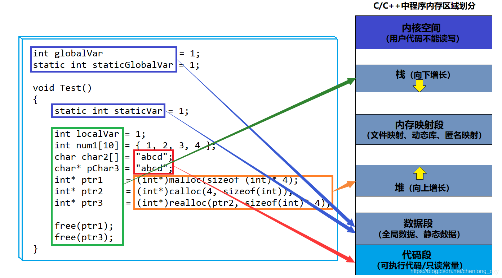

# 内存分布

四大区域：代码段、数据段、堆、内存映射段、栈

栈是向下增长的，而堆是向上增长的。

在堆区开辟空间，后开辟的空间地址不一定比先开辟的空间地址高。因为在堆区，后开辟的空间也有可能位于前面某一被释放的空间位置。

1. 栈又叫堆栈，用于存储非静态局部变量/函数参数/返回值等等，栈是向下增长的。
2. 内存映射段是高效的I/O映射方式，用于装载一个共享的动态内存库。用户可使用系统接口创建共享内存，做进程间通信。
3. 堆用于存储运行时动态内存分配，堆是向上增长的。
4. 数据段又叫静态区，用于存储全局数据和静态数据。
5. 代码段又叫常量区，用于存放可执行的代码和只读常量。

# C中动态内存管理方式

## malloc

malloc函数的功能是开辟指定字节大小的内存空间，如果开辟成功就返回该空间的首地址，如果开辟失败就返回一个NULL。传参时只需传入需要开辟的字节个数。

## calloc

calloc函数的功能也是开辟指定大小的内存空间，如果开辟成功就返回该空间的首地址，如果开辟失败就返回一个NULL。calloc函数传参时需要传入开辟的内存用于存放的元素个数和每个元素的大小。calloc函数开辟好内存后会将空间内容中的每一个字节都初始化为0。

## realloc

realloc函数可以调整已经开辟好的动态内存的大小，第一个参数是需要调整大小的动态内存的首地址，第二个参数是动态内存调整后的新大小。realloc函数与上面两个函数一样，如果开辟成功便返回开辟好的内存的首地址，开辟失败则返回NULL。

realloc函数调整动态内存大小的时候会有三种情况：
1. 原地扩。需扩展的空间后方有足够的空间可供扩展，此时，realloc函数直接在原空间后方进行扩展，并返回该内存空间首地址（即原来的首地址）。
2. 异地扩。需扩展的空间后方没有足够的空间可供扩展，此时，realloc函数会在堆区中重新找一块满足要求的内存空间，把原空间内的数据拷贝到新空间中，并主动将原空间内存释放（即还给操作系统），返回新内存空间的首地址。
3. 扩充失败。需扩展的空间后方没有足够的空间可供扩展，并且堆区中也没有符合需要开辟的内存大小的空间。结果就是开辟内存失败，返回一个NULL。

## free

free函数的作用就是将malloc、calloc以及realloc函数申请的动态内存空间释放，其释放空间的大小取决于之前申请的内存空间的大小。

# C++中动态内存管理方式

## new和delete