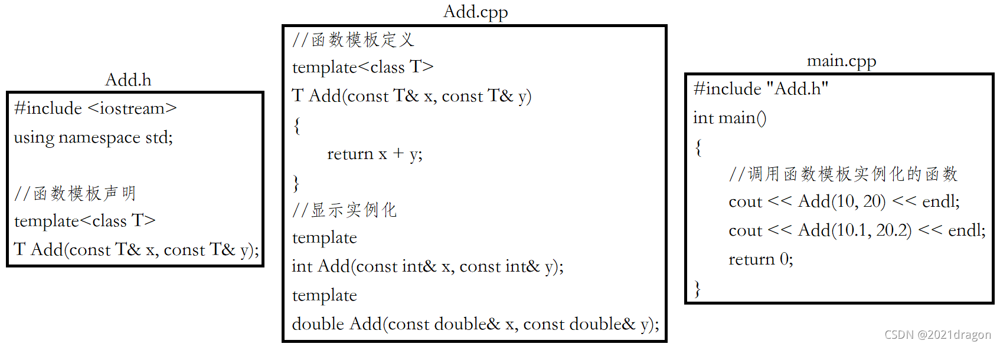

# 函数模板

在使用时被参数化，根据实参类型产生函数的特定类型版本

## 函数模板格式

typename是用来定义模板参数的关键字，也可以用class代替，但是不能用struct代替

```cpp
template<typename T1,typename T2,…,typename Tn>
返回类型 函数名(参数列表)
{
  //函数体
}

如：
template<typename T>
void Swap(T& x, T& y)
{
	T tmp = x;
	x = y;
	y = tmp;
}
```

## 函数模板的实例化

1. 隐式实例化

```cpp
int c = Add(a, b); //编译器根据实参a和b推演出模板参数为int类型

若：
int a = 10;
double b = 1.1;
int c = Add(a, b);
```
使用模板时，编译器一般不会进行类型转换操作，传入两个不同类型的参数，第一种方法传参时将b强制转换为int类型，第二种使用显示实例化

2. 显示实例化

使用显示实例化时，如果传入的参数类型与模板参数类型不匹配，编译器会尝试进行隐式类型转换，如果无法转换成功，则编译器将会报错

```cpp
int c = Add<int>(a, b); //指定模板参数的实际类型为int
```

## 函数模板的匹配原则

1. 一个非模板函数可以和一个同名的函数模板同时存在，而且该函数模板还可以被实例化为这个非模板函数

```cpp
//专门用于int类型加法的非模板函数
int Add(const int& x, const int& y)
{
	return x + y;
}

//通用类型加法的函数模板
template<typename T>
T Add(const T& x, const T& y)
{
	return x + y;
}

int a = 10, b = 20;
int c = Add(a, b); //调用非模板函数，编译器不需要实例化
int d = Add<int>(a, b); //调用编译器实例化的Add函数
```                      

2. 对于非模板函数和同名的函数模板，如果其他条件都相同，在调用时会优先调用非模板函数，而不会从该模板产生出一个实例。如果模板可以产生一个具有更好匹配的函数，那么选择模板

```cpp
//专门用于int类型加法的非模板函数
int Add(const int& x, const int& y)
{
	return x + y;
}

//通用类型加法的函数模板
template<typename T1, typename T2>
T1 Add(const T1& x, const T2& y)
{
	return x + y;
}

int a = Add(10, 20); //与非模板函数完全匹配，不需要函数模板实例化
int b = Add(2.2, 2); //函数模板可以生成更加匹配的版本，编译器会根据实参生成更加匹配的Add函数
```  

3. 模板函数不允许自动类型转换，但普通函数可以进行自动类型转换

```cpp
template<typename T>
T Add(const T& x, const T& y)
{
	return x + y;
}

int a = Add(2, 2.2); //模板函数不允许自动类型转换，不能通过编译
```

# 类模板

## 类模板格式

类模板不支持分离编译，即声明在xxx.h文件中，而定义却在xxx.cpp文件中

```cpp
template<class T1,class T2,…,class Tn>
class 类模板名
{
  //类内成员声明
};

template<class T>
class Score
{
public:
	void Print()
	{
		cout << "数学:" << _Math << endl;
		cout << "语文:" << _Chinese << endl;
		cout << "英语:" << _English << endl;
	}
private:
	T _Math;
	T _Chinese;
	T _English;
};

template<class T>
class Score
{
public:
	void Print();
private:
	T _Math;
	T _Chinese;
	T _English;
};
//类模板中的成员函数在类外定义，需要加模板参数列表
template<class T>
void Score<T>::Print()
{
	cout << "数学:" << _Math << endl;
	cout << "语文:" << _Chinese << endl;
	cout << "英语:" << _English << endl;
}
```

## 类模板的实例化

类模板实例化需要在类模板名字后面跟<>，然后将实例化的类型放在<>中即可。

类模板名字不是真正的类，而实例化的结果才是真正的类

```cpp
//Score不是真正的类，Score<int>和Score<double>才是真正的类
Score<int> s1;
Score<double> s2;
```

# 非类型模板参数

模板参数可分为类型形参和非类型形参

1. 类型形参： 出现在模板参数列表中，跟在class或typename关键字之后的参数类型名称。

2. 非类型形参： 用一个常量作为类（函数）模板的一个参数，在类（函数）模板中可将该参数当成常量来使用。
	- 非类型模板参数只允许使用**整型家族**，浮点数、类对象以及字符串是不允许作为非类型模板参数的。
	- 非类型的模板参数在编译期就需要确认结果，因为编译器在编译阶段就需要根据传入的非类型模板参数生成对应的类或函数。

# 模板的特化

使用模板可以实现一些与类型无关的代码，但对于一些特殊的类型可能会得到一些错误的结果，此时就需要对模板进行特化，即在原模板的基础上，针对特殊类型进行特殊化的实现方式。

## 函数模板特化

步骤：

1. 必须要有一个基础的函数模板。
2. 关键字template后面接一对空的尖括号<>。
3. 函数名后跟一对尖括号，尖括号中指定需要特化的类型。
4. 函数形参表必须要和模板函数的基础参数类型完全相同，否则不同的编译器可能会报一些奇怪的错误。

```cpp
//基础的函数模板
template<class T>
bool IsEqual(T x, T y)
{
	return x == y;
}
//对于char*类型的特化
template<>
bool IsEqual<char*>(char* x, char* y)
{
	return strcmp(x, y) == 0;
}

// 如果函数模板遇到不能处理或者处理有误的类型，为了实现简单通常都是将该函数直接给出。例如，上述实例char*类型的特化还可以这样给出：

//对于char*类型的特化
bool IsEqual(char* x, char* y)
{
	return strcmp(x, y) == 0;
}
```

## 类模板特化

步骤：

1. 必须要有一个基础的类模板。
2. 关键字template后面接一对空的尖括号<>。
3. 类名后跟一对尖括号，尖括号中指定需要特化的类型。

类模板的特化又可分为全特化和偏特化（半特化）

1. 全特化：将模板参数列表中所有的参数都确定化。

```cpp
template<class T1, class T2>
class Dragon
{
public:
	//构造函数
	Dragon()
	{
		cout << "Dragon<T1, T2>" << endl;
	}
private:
	T1 _D1;
	T2 _D2;
};

//对于T1是double，T2是int时进行特化
template<>
class Dragon<double, int>
{
public:
	//构造函数
	Dragon()
	{
		cout << "Dragon<double, int>" << endl;
	}
private:
	double _D1;
	int _D2;
};
```

2. 偏特化：指任何针对模板参数进一步进行条件限制设计的特化版本。
	- 部分特化：仅对模板参数列表中的部分参数进行确定化。
	- 参数更进一步的限制：偏特化并不仅仅是指特化部分参数，而是针对模板参数进一步的条件限制所设计出来的一个特化版本。
```cpp
//例如，对T1为int类型的类进行特殊化处理
template<class T2>
class Dragon<int, T2>
{
public:
	//构造函数
	Dragon()
	{
		cout << "Dragon<int, T2>" << endl;
	}
private:
	int _D1;
	T2 _D2;
}

//只要实例化对象时指定T1为int，就会使用这个特化的类模板来实例化对象
Dragon<int, int> d1;
```

```cpp
//例如，指定当T1和T2为某种类型时，使用特殊化的类模板
//两个参数偏特化为指针类型
template<class T1, class T2>
class Dragon<T1*, T2*>
{
public:
	//构造函数
	Dragon()
	{
		cout << "Dragon<T1*, T2*>" << endl;
	}
private:
	T1 _D1;
	T2 _D2;
};
//两个参数偏特化为引用类型
template<class T1, class T2>
class Dragon<T1&, T2&>
{
public:
	//构造函数
	Dragon()
	{
		cout << "Dragon<T1&, T2&>" << endl;
	}
private:
	T1 _D1;
	T2 _D2;
};
//当实例化对象的T1和T2同时为指针类型或同时为引用类型时，就会分别调用我们特化的两个类模板
Dragon<int*, int*> d1;
Dragon<int&, int&> d2;
```

# 模板的分离编译

分离编译：一个程序（项目）由若干个源文件共同实现，而每个源文件单独编译生成目标文件，最后将所有目标文件链接起来形成单一的可执行文件的过程称为分离编译模式。

模板的分离编译，预处理、编译和汇编都没有问题，但在链接时发现，在main函数当中调用的两个Add函数实际上并没有被真正定义，主要原因是函数模板并没有生成对应的函数，因为在全过程中都没有实例化过函数模板的模板参数T，所以函数模板根本就不知道该实例化T为何类型的函数。

即：**在函数模板定义的地方（Add.cpp）没有进行实例化，而在需要实例化函数的地方（main.cpp）没有模板函数的定义，无法进行实例化。**

解决方法：

1. 在模板定义的位置进行显示实例化


2. 对于模板最好不要进行分离编译，不论是函数模板还是类模板，将模板的声明和定义都放到一个文件当中（推荐）