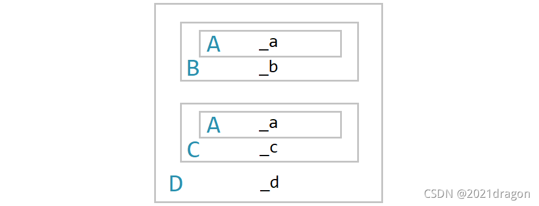
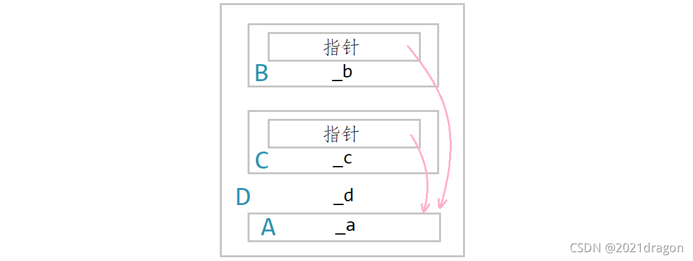

# 继承 inheritance

在保持原有类特性的基础上进行扩展，增加功能。

继承呈现了面向对象程序设计的层次结构，体现了由简单到复杂的认知过程。以前我们接触的复用都是函数复用，而继承便是类设计层次的复用。

基类 -> 派生类

父类 -> 子类

继承后，父类的成员，包括成员函数和成员变量，都会变成子类的一部分，即子类复用了父类的成员。

格式定义：
```cpp
class 派生类 ：继承方式 基类 {
    ...
};
```

# 继承方式和访问限定符

继承方式：
1. public继承
2. protected继承
3. private继承

访问限定符：权限大小public > protected > private
1. public访问
2. protected访问
3. private访问

继承基类成员访问方式的变化:

|    基类成员   | public继承 | protected继承 | private继承 |
|---------------|------------|--------------|-------------|
|   public成员  |   public   |   protected  |   private   |
| protected成员 |  protected |   protected  |   private   |
|  private成员  |    不可见  |     不可见    |    不可见   |

注：
1. 在基类当中的访问方式为public或protected的成员，在派生类当中的访问方式变为：Min(成员在基类的访问方式，继承方式)。
2. 在基类当中的访问方式为private的成员，在派生类当中都是不可见的。（无法在派生类当中访问基类的private成员）
3. 如果基类成员不想在类外直接被访问，但需要在派生类中能访问，就需要定义为protected（protected限定符是因继承才出现的）
4. 实际运用中一般使用的都是public继承
5. **默认继承方式**：不指定继承方式，class默认的继承方式是private，struct默认的继承方式是public

# 基类和派生类对象赋值转换

派生类对象可以赋值给基类的对象、基类的指针以及基类的引用，因为在这个过程中，会发生基类和派生类对象之间的赋值转换（切片/切割：把派生类中基类那部分切来赋值过去）

```cpp
Student s;
Person p = s;     //派生类对象赋值给基类对象
Person* ptr = &s; //派生类对象赋值给基类指针
Person& ref = s;  //派生类对象赋值给基类引用
```

注：
基类对象不能赋值给派生类对象，基类的指针可以通过强制类型转换赋值给派生类的指针，但是此时基类的指针必须是指向派生类的对象才是安全的。

# 继承中的作用域

若子类和父类中有同名成员，子类成员将屏蔽父类对同名成员的直接访问，这种情况叫隐藏，也叫重定义

如果是成员函数的隐藏，只需要函数名相同就构成隐藏

```cpp
Person::_num //指定访问父类当中的_num成员

Student s;
s.fun(3.14);       //直接调用子类当中的成员函数fun
s.Person::fun(20); //指定调用父类当中的成员函数fun
```

父类中的fun和子类中的fun不是构成函数重载，因为函数重载要求两个函数在同一作用域，而此时这两个fun函数并不在同一作用域。为了避免类似问题，实际在继承体系当中最好不要定义同名的成员

# 派生类的默认成员函数

与普通类的默认成员函数的不同之处：
1. 派生类的构造函数被调用时，会自动调用基类的构造函数初始化基类的那一部分成员，如果基类当中没有默认的构造函数，则必须在派生类构造函数的初始化列表当中显示调用基类的构造函数。
2. 派生类的拷贝构造函数必须调用基类的拷贝构造函数完成基类成员的拷贝构造。
3. 派生类的赋值运算符重载函数必须调用基类的赋值运算符重载函数完成基类成员的赋值。
4. 派生类的析构函数会在被调用完成后自动调用基类的析构函数清理基类成员。
5. 派生类对象初始化时，会先调用基类的构造函数再调用派生类的构造函数。
6. 派生类对象在析构时，会先调用派生类的析构函数再调用基类的析构函数。

注：
1. 派生类和基类的赋值运算符重载函数因为函数名相同构成隐藏，因此在派生类当中调用基类的赋值运算符重载函数时，需要使用作用域限定符进行指定调用。
2. 由于多态，任何类的析构函数名都会被统一处理为destructor()。因此，派生类和基类的析构函数也会因为函数名相同构成隐藏，若需要在某处调用基类的析构函数，那么就要使用作用域限定符进行指定调用。
3. 在派生类的拷贝构造函数和operator=当中调用基类的拷贝构造函数和operator=的传参方式是一个切片行为，都是将派生类对象直接赋值给基类的引用。
4. 基类的构造函数、拷贝构造函数、赋值运算符重载函数都可以在派生类当中自行进行调用，而基类的析构函数是当派生类的析构函数被调用后由编译器自动调用的，若是自行调用基类的构造函数就会导致基类被析构多次的问题。
5. 创建派生类对象时是先创建的基类成员再创建的派生类成员，编译器为了保证析构时先析构派生类成员再析构基类成员的顺序析构，所以编译器会在派生类的析构函数被调用后自动调用基类的析构函数。

```cpp
//基类
class Person
{
public:
	//构造函数
	Person(const string& name = "peter")
		:_name(name)
	{
		cout << "Person()" << endl;
	}
	//拷贝构造函数
	Person(const Person& p)
		:_name(p._name)
	{
		cout << "Person(const Person& p)" << endl;
	}
	//赋值运算符重载函数
	Person& operator=(const Person& p)
	{
		cout << "Person& operator=(const Person& p)" << endl;
		if (this != &p)
		{
			_name = p._name;
		}
		return *this;
	}
	//析构函数
	~Person()
	{
		cout << "~Person()" << endl;
	}
private:
	string _name; //姓名
};

//派生类
class Student : public Person
{
public:
	//构造函数
	Student(const string& name, int id)
		:Person(name) //调用基类的构造函数初始化基类的那一部分成员
		, _id(id) //初始化派生类的成员
	{
		cout << "Student()" << endl;
	}
	//拷贝构造函数
	Student(const Student& s)
		:Person(s) //调用基类的拷贝构造函数完成基类成员的拷贝构造
		, _id(s._id) //拷贝构造派生类的成员
	{
		cout << "Student(const Student& s)" << endl;
	}
	//赋值运算符重载函数
	Student& operator=(const Student& s)
	{
		cout << "Student& operator=(const Student& s)" << endl;
		if (this != &s)
		{
			Person::operator=(s); //调用基类的operator=完成基类成员的赋值
			_id = s._id; //完成派生类成员的赋值
		}
		return *this;
	}
	//析构函数
	~Student()
	{
		cout << "~Student()" << endl;
		//派生类的析构函数会在被调用完成后自动调用基类的析构函数
	}
private:
	int _id; //学号
};
```

# 继承与友元

友元关系不能继承，也就是说基类的友元可以访问基类的私有和保护成员，但是不能访问派生类的私有和保护成员

需要重新声明友元

# 继承与静态成员

若基类当中定义了一个static静态成员变量，则在整个继承体系里面只有一个该静态成员。无论派生出多少个子类，都只有一个static成员实例

例：若是在基类的构造函数和拷贝构造函数当中设置静态成员_count进行自增，那么我们就可以随时通过_count来获取该时刻已经实例化的基类、子类对象的总个数

# 继承的方式

单继承：一个子类只有一个直接父类

多继承：一个子类有两个或两个以上直接父类

菱形继承：菱形继承是多继承的一种特殊情况，存在数据冗余和二义性的问题


```cpp
    A
   / \
  B   C
   \ /
    D

class B : public A {};
class C : public A {};
class D : public B, public C {};
D d;
d._name = "peter"; //二义性：无法明确知道要访问哪一个_name
//显示指定访问哪个父类的成员

// 可以解决二义性的问题，但仍然不能解决数据冗余的问题，基类成员始终存在两份
d.b::_name = "张同学";
d.c::_name = "张老师";
```

# 虚继承（菱形虚拟继承）

数据冗余问题：在B和C继承A使用虚拟继承

```cpp
class B : virtual public A {}; //虚拟继承
class C : virtual public A {}; //虚拟继承
class D : public B, public C {};

// 可直接访问D对象的_name成员
// 指定访问D的父类的_name成员，访问到的都是同一个结果，解决了二义性的问题
cout << d.b::_name << endl; //peter
cout << d.c::_name << endl; //peter

//打印两个父类的_name成员的地址时，显示的也是同一个地址，解决了数据冗余的问题
cout << &a.Student::_name << endl; //0136F74C
cout << &a.Teacher::_name << endl; //0136F74C
```

## 原理
不使用菱形虚拟继承时，以下菱形继承当中D类对象的各个成员在内存当中的分布情况：
```cpp
    A
   / \
  B   C
   \ /
    D

#include <iostream>
using namespace std;
class A
{
public:
	int _a;
};
class B : public A
{
public:
	int _b;
};
class C : public A
{
public:
	int _c;
};
class D : public B, public C
{
public:
	int _d;
};
int main()
{
	D d;
	d.B::_a = 1;
	d.C::_a = 2;
	d._b = 3;
	d._c = 4;
	d._d = 5;
	return 0;
}
```
D类对象当中含有两个_a成员



使用菱形虚拟继承时，以下菱形继承当中D类对象的各个成员在内存当中的分布情况：
```
           A
 virtual  / \  virtual
         B   C
          \ /
           D
```
D类对象当中的_a成员被放到了最后，而在原来存放两个_a成员的位置变成了两个**虚基表指针**，它们分别指向一个虚基表。

虚基表中包含两个数据，第一个数据是为多态的虚表预留的存偏移量的位置（这里我们不必关心），第二个数据就是当前类对象位置距离公共虚基类的偏移量。



注：
1. 若将D类对象赋值给B类对象，在这个切片过程中，就需要通过虚基表中的第二个数据找到公共虚基类A的成员，得到切片后该B类对象在内存中仍然保持这种分布情况，a对象仍然存储在该B类对象的最后。
2. C++多继承就是其语法复杂的体现，即可能存在菱形继承、虚继承，底层实现就很复杂。一般不建议设计出菱形继承，代码的复杂度及性能上会出现问题，菱形继承出问题时难以分析，并且会有一定的效率影响。
3. 很多后来的面向对象(OO, Object Oriented)语言都没有多继承，如Java。

# 继承和组合

描述类之间关系：
- is-a：每个派生类对象都**是**一个基类对象；如动物类与狗类，它们之间适合使用继承。
```cpp
class Animal {
public:
    void eat() {}
};

class Dog : public Animal {
public:
    void bark() {}
};
```
- has-a：某个类中**有**另一个类的实例；如车类与引擎类，它们之间则适合使用组合。
```cpp
class Engine {
public:
    void start() {}
};

class Car {
private:
    Engine engine;
public:
    void startCar() {
        engine.start();
    }
};
```

注：
1. 若是两个类之间既可以看作is-a的关系，又可以看作has-a的关系，则优先使用组合。
2. 继承允许你根据基类的实现来定义派生类的实现，这种通过生成派生类的复用通常被称为白箱复用(White-box
reuse)。术语“白箱”是相对可视性而言：在继承方式中，基类的内部细节对于派生类可见，继承一定程度破坏了基类的封装，基类的改变对派生类有很大的影响，派生类和基类间的依赖性关系很强，耦合度高。
3. 组合是类继承之外的另一种复用选择，新的更复杂的功能可以通过组装或组合对象来获得。对象组合要求被组合的对象具有良好定义的接口，这种复用风格被称之为黑箱复用(Black-box reuse)，因为对象的内部细节是不可见的，对象只以“黑箱”的形式出现，组合类之间没有很强的依赖关系，耦合度低，优先使用对象组合有助于你保持每个类被封装。
4. 实际中尽量多使用组合，组合的耦合度低，代码维护性好。不过继承也是有用武之地的，有些关系就适合用继承，另外要实现多态也必须要继承。

# 继承面试题：
1. 什么是菱形继承？菱形继承的问题是什么？

> 菱形继承是多继承的一种特殊情况，两个子类继承同一个父类，而又有子类同时继承这两个子类，我们称这种继承为菱形继承。
>
> 菱形继承因为子类对象当中会有两份父类的成员，因此会导致数据冗余和二义性的问题。

2. 什么是菱形虚拟继承？如何解决数据冗余和二义性？

> 菱形虚拟继承是指在菱形继承的腰部使用虚拟继承(virtual)的继承方式，菱形虚拟继承对于D类对象当中重复的A类成员只存储一份，然后采用虚基表指针和虚基表使得D类对象当中继承的B类和C类可以找到自己继承的A类成员，从而解决了数据冗余和二义性的问题。

3. 继承和组合的区别？什么时候用继承？什么时候用组合？

> 继承是一种is-a的关系，而组合是一种has-a的关系。如果两个类之间是is-a的关系，使用继承；如果两个类之间是has-a的关系，则使用组合；如果两个类之间的关系既可以看作is-a的关系，又可以看作has-a的关系，则优先使用组合。