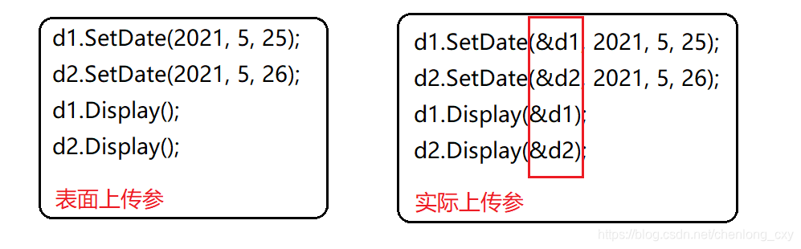
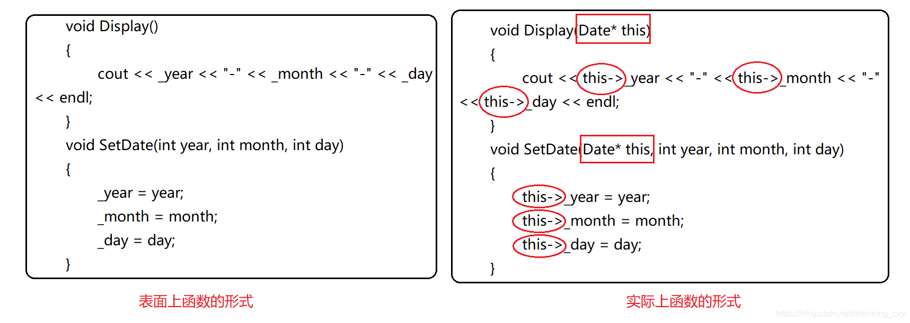
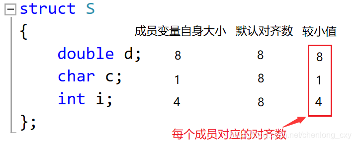
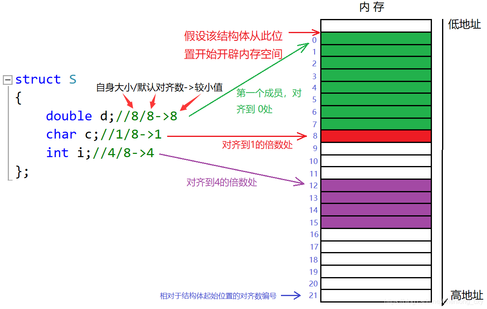

# 第一个函数

main()函数可以不返回值，默认返回0

std::cout 将字符串输出到屏幕上的控制台

<< 重载运算符 相当于 .prinf()

std::endl 将光标移动到下一行

std::cin.get() 获取一个字符串

# 编译

## 1. 预处理（Preprocessing）

头文件展开、去注释、宏替换、条件编译等。

* 遍历所有预处理语句并对其进行评估。
* 处理 `#include`、`#define`、`#ifndef` 、`pragma`等预处理指令。
* 文件被展开：例如 `#include <iostream>` 会把 iostream 头文件的内容复制到源文件中。

命令（G++）：`g++ -E main.cpp -o main.i`
输出：`.i` 文件（纯 C++ 源代码）

## 2. 编译（Compiling）

检查代码的规范性、是否有语法错误等，确定代码实际要做的工作，在检查无误后，将代码翻译成汇编语言。

* 将预处理后的源代码转换为汇编语言。
* 语法分析、词法分析、生成中间代码。
* 常量折叠 constant folding：编译阶段堆程序中的常量表达式进行计算，将其结果直接替换原表达式，减少运行时的计算开销

命令：`g++ -S main.i -o main.s`
输出：`.s` 文件（汇编代码）

## 3. 汇编（Assembling）

把编译阶段生成的文件转成目标文件。

* 将汇编代码翻译成机器语言（目标代码）。

命令：`g++ -c main.s -o main.o`
输出：`.o` 或 `.obj` 文件（目标文件）

前三个部分也统称为编译
---

## 4. 链接（Linking）

将生成的各个目标文件进行链接，生成可执行文件。

* 将多个 `.o` 文件和库文件合并为一个可执行文件。
* 解决函数调用、变量定义等引用。
* 通常定义main函数作为入口entry。也可是任意函数。
* 未解析的外部符号：调用函数时函数名错误、参数缺失、函数定义重复等。
* 其他编译错误：函数重复可使用static inline， 头部只函数声明。

命令：`g++ main.o -o main.exe`
输出：`.exe`（可执行程序）

## 多文件编译

```cpp
// main.cpp
#include "func.h"
int main() {
    hello();
    return 0;
}

// func.cpp
#include <iostream>
void hello() {
    std::cout << "Hello, world!" << std::endl;
}

// func.h
void hello();
```

编译方式：

```bash
g++ main.cpp func.cpp -o main.exe
```

---

## 名词解释

| 概念               | 含义                                          |
| ---------------- | ------------------------------------------- |
| 声明 (declaration) | 告诉编译器某个符号存在，但不分配内存，如：`extern int a;`、函数原型等。 |
| 定义 (definition)  | 为变量或函数分配内存，给出完整实现，例如：`int a = 5;`、函数体等。     |
| 头文件 (header)     | 存储声明，用于共享函数/类接口。                            |
| 源文件 (.cpp)       | 存储定义，具体的实现内容。                               |

---

## Debug vs Release 模式

| 模式      | 特点                                |
| ------- | --------------------------------- |
| Debug   | - 包含调试信息<br>- 禁用优化<br>- 更慢，适合开发阶段 |
| Release | - 启用编译器优化<br>- 无调试信息<br>- 更快，适合发布 |

---

## 常用输入输出操作

```cpp
#include <iostream>

int main() {
    std::cout << "Hello" << std::endl;  // 输出 + 换行
    std::cin.get();                     // 获取一个字符，常用于暂停控制台
    return 0;                           // main 可以省略 return，C++11 后默认返回 0
}
```

---

## 提示技巧

* C++11 起，`main()` 函数可以省略 `return 0;`
* 使用 `std::` 是因为 I/O 定义在 `std` 命名空间中
* `.h` 文件不要写函数定义（仅声明），否则可能重复定义（重复编译）
---

# 变量
命名存储数据在内存中
存储位置：内存中的栈stack和堆heap

原始数据类型 唯一区别占多少size
int integer有符号 4字节

```cpp
int v = 8; //-2b - 2b
unsigned int //0 - 4b
```

char(1), short(2), int(4), long(4), long long(8)
float(4), double(8)

```cpp
float v = 5.5f; // 5.5F
double v = 5.5;
```
bool(1): true 1   false 0

sizeof(int) 输出数据类型的字节数

bool* 指针pointer
bool& 引用reference

---

# 常引用

引用类型必须和引用实体是同种类型的。但是仅仅是同种类型，还不能保证能够引用成功，我们若用一个普通引用类型去引用其对应的类型，但该类型被const所修饰，那么引用将不会成功。

```cpp
int main()
{
	const int a = 10;
	//int& ra = a;    //该语句编译时会出错，a为常量
	const int& ra = a;//正确
	
	//int& b = 10;    //该语句编译时会出错，10为常量
	const int& b = 10;//正确
	return 0;
}
```

我们可以将被const修饰了的类型理解为安全的类型，因为其不能被修改。我们若将一个安全的类型交给一个不安全的类型（可被修改），那么将不会成功。

---

# 引用与指针的区别

在语法概念上，引用就是一个别名，没有独立的空间，其和引用实体共用同一块空间。

1. 引用在定义时必须初始化，指针没有要求。
2. 引用在初始化时引用一个实体后，就不能再引用其他实体，而指针可以在任何时候指向任何一个同类型实体。
3. 没有NULL引用，但有NULL指针。
4. 在sizeof中的含义不同：引用的结果为引用类型的大小，但指针始终是地址空间所占字节个数（32位平台下占4个字节）。
5. 引用进行自增操作就相当于实体增加1，而指针进行自增操作是指针向后偏移一个类型的大小。
6. 有多级指针，但是没有多级引用。
7. 访问实体的方式不同，指针需要显示解引用，而引用是编译器自己处理。
8. 引用比指针使用起来相对更安全。

---

# 函数function
执行特定任务的代码块，无需大量复制粘贴，防止代码重复
input
output
函数调用 call ：编译器生成一个调用指令，创建堆栈、压栈、拿出返回值，回到最初调用的位置

主函数无需返回值

# 缺省参数

缺省参数不能在函数声明和定义中同时出现，缺省参数只能在函数声明时出现，或者函数定义时出现（二者之一均正确）。

缺省值必须是常量或者全局变量

## 半缺省参数

如果一个函数的参数有默认值（也叫半缺省参数），那么在调用函数时，如果你想指定某些参数的值，就必须从右侧开始依次给出，而不能跳过某些中间的参数。

即**如果一个函数的参数列表中有默认值，你必须从右边开始为参数传值，而不能跳过某个间隔的参数。**

### 例子：

假设有一个函数，定义如下：

```cpp
void func(int a, int b = 10, int c = 20) {
    // 函数实现
}
```

这里，`b` 和 `c` 有默认值。调用 `func` 时，有几个规则：

* 你可以只传递 `a`，`b` 和 `c` 会使用默认值。
* 如果你想指定 `b` 的值，那么 `c` 也必须指定，因为 `b` 和 `c` 是从右往左有默认值的。

#### 正确的调用方式：

```cpp
func(1);         // a=1, b=10, c=20（b和c使用默认值）
func(1, 5);      // a=1, b=5, c=20（c使用默认值）
func(1, 5, 30);  // a=1, b=5, c=30（都给了值）
```

#### 错误的调用方式：

```cpp
func(1, , 30);   // 错误！不能跳过 b，直接给 c
```

---

# 函数重载
函数重载是函数的一种特殊情况，C++允许在同一作用域中声明几个功能类似的同名函数，这些同名函数的**形参列表**必须不同。函数重载常用来处理实现功能类似，而数据类型不同的问题。

**形参列表不同是指参数个数、参数类型或者参数顺序不同，若仅仅是返回类型不同，则不能构成重载。**

## 函数重载的原理(名字修饰)

为什么C++支持函数重载，而C语言不支持函数重载呢？

我们知道，一个C/C++程序要运行起来都需要经历以下几个阶段：预处理、编译、汇编、链接。

在编译阶段会将程序中的每个源文件的全局范围的变量符号分别进行汇总。在汇编阶段会给每个源文件汇总出来的符号分配一个地址（若符号只是一个声明，则给其分配一个无意义的地址），然后分别生成一个符号表。最后在链接期间会将每个源文件的符号表进行合并，若不同源文件的符号表中出现了相同的符号，则取合法的地址为合并后的地址（重定位）。

在C语言中，汇编阶段进行符号汇总时，一个函数汇总后的符号就是其函数名，所以当汇总时发现多个相同的函数符号时，编译器便会报错。而C++在进行符号汇总时，对函数的名字修饰做了改动，函数汇总出的符号不再单单是函数的函数名，而是通过其参数的类型和个数以及顺序等信息汇总出 一个符号，这样一来，就算是函数名相同的函数，只要其参数的类型或参数的个数或参数的顺序不同，那么汇总出来的符号也就不同了。

注：不同编译器下，对函数名的修饰不同，但都是一样的。

### 总结：
1. C语言不能支持重载，是因为同名函数没办法区分。而C++是通过函数修饰规则来区分的，只要函数的形参列表不同，修饰出来的名字就不一样，也就支持了重载。
2. 另外我们也理解了，为什么函数重载要求参数不同，根返回值没关系。

---

# 头文件header files
声明某些类型和函数 无函数主体
函数签名 就是函数的第一行+ ';'

## `#pragma once` 只包含此文件一次
预处理指令，头文件保护，防止将一个头文件多次包含到一个翻译单元translation unit中

旧处理方法：
```cpp
#ifndef _LOG_H
#define _LOG_H

void Log(const char* msg);

struct Player {};

#endif
```

## <> 与 ""
<> 仅适用于编译器包含路径
"" 适用于所有内容

## .h?
c标准库文件末尾带h扩展名
Cpp文件没有

# 调试debug
从代码中删除bug

## breakpoint
程序中的一个点，调试器debugger会在此时中断，挂起执行线程

可在任何一行代码上设置断点，然后查看内存情况（变量设置、调用函数等）

step into：进入当前函数
step over：跳转到当前函数的下一行代码
step out：跳出当前函数

箭头表示即将运行这行代码而不是已经运行
内存视图 可展示所有内存

# 条件和分支 conditions and branches

## if-else语句
运行代码，评估结果，若条件为真执行分支，若为假往下执行

在内存中跳转

# 循环 loops

## for循环

## while循环

---

# 类

## 定义

```cpp
class className
{
	//类体：由成员变量和成员函数组成

};  //注意后面的分号
```

class为定义类的关键字，className为类的名字，{}中为类的主体，注意定义结束时加上后面的分号。

类中的元素称为类的成员：类中的数据称为类的属性或者成员变量，类中的函数称为类的方法或者成员函数。

1. 第一种定义：声明和定义全部放在类体中。需要注意：成员函数如果在类中定义，编译器可能会将其当成**内联函数**处理。
2. 第二种定义：声明放在头文件(.h)中，定义放在源文件(.cpp)中。（一般采用此种）


## 类的访问限定符
public共有，protected保护,privat私有，

1. C++实现封装的方式：用类将对象的属性和方法结合在一块，让对象更加完善，通过访问权限，选择性的将其接口提供给外部的用户使用。
2. public修饰的成员可以在类外直接被访问。
3. protected和private修饰的成员在类外不能直接被访问。
4. 访问权限从该访问限定符出现的位置开始直到下一个访问限定符出现时为止。
5. class的默认访问权限为private，struct为public（因为struct要兼容C）。

### 题目：C++中的struct和class的区别是什么？

C++需要兼容C语言，所以C++中的struct可以当成结构体去使用。此外，C++中的struct还可以用来定义类，和class定义类是一样的，区别是struct的成员默认访问权限是public，而class的成员默认访问权限是private。

## 类的存储方式

一个类的大小，实际就是该类中“成员变量”之和，当然也要进行内存对齐，注意空类的大小，空类比较特殊，编译器给了空类一个字节来唯一标识这个类（占位）。

```cpp
// 类中既有成员变量，又有成员函数
class A1 {
public:
	void f1(){}
private:
	int _a;
};
// 类中仅有成员函数
class A2 {
public:
	void f2() {}
};
// 类中什么都没有---空类
class A3
{};
```
通过单目操作符sizeof来获取这三个对象的大小，结果A1的大小为4个字节，A2的大小为1个字节，A3的大小也为1个字节。

## this 指针

C++编译器给每个“非静态的成员函数”增加了一个隐藏的指针参数，让该指针指向当前对象（函数运行时调用该函数的对象），在函数体中所有成员变量的操作，都是通过该指针去访问的。只不过所有操作对用户是透明的，即用户不需要来传递，而是编译器自动完成。

调用成员函数传参时，看似只传入了一些基本数据，实际上还传入了指向该对象的指针：



编译器进行编译时，看到的成员函数实际上也和我们所看到的不一样，每个成员函数的第一个形参实际上是一个隐含的this指针，该指针用于接收调用函数的对象的地址，用this指针就可以很好地访问到该对象中的成员变量：




### this指针的特性

1. this指针的类型：类的类型* const。
2. this指针只能在“成员函数”的内部使用。
3. this指针本质上其实是一个**成员函数的形参**，是对象调用成员函数时，将对象地址作为实参传递给this形参。所以对象中不存储this指针。
4. this指针是成员函数第一个隐含的指针形参，一般情况由编译器通过ecx寄存器自动传递，不需要用户传递。

## 类的6个默认成员函数

任何一个类，即使我们什么都不写，类中也会自动生成6个默认成员函数。

- 初始化和清理
    - 构造函数：初始化
    - 析构函数：清理
- 拷贝复制
    - 拷贝构造：使用同类对象初始化创建对象
    - 赋值重载：把一个对象赋值给另一个对象
- 取地址重载（很少会自己实现）
    - 普通对象取地址
    - const对象取地址

注意：这里的“默认”和“缺省”的意思差不多，也就是你不写这6个函数，编译器会自动生成，你若是写了，则编译器就不生成了。

### 构造函数

名字与类名相同，创建类类型对象时由编译器自动调用，保证每个数据成员都有一个合适的初始值，并且在对象的生命周期内只调用一次。

```cpp
class Date
{
public:
	Date(int year = 0, int month = 1, int day = 1)// 构造函数
	{
		_year = year;
		_month = month;
		_day = day;
	}
	void Print()
	{
		cout << _year << "年" << _month << "月" << _day << "日" << endl;
	}
private:
	int _year;
	int _month;
	int _day;
};
```

注意：构造函数的主要任务并不是开空间创建对象，而是初始化对象。

构造函数中的语句只能将其称作为赋初值，而不能称作为初始化.

#### 构造函数初始化

初始化列表：以一个冒号开始，接着是一个以逗号分隔的数据成员列表，每个成员变量后面跟一个放在括号中的初始值或表达式。

```cpp
class Date
{
public:
	// 构造函数
	Date(int year = 0, int month = 1, int day = 1)
		:_year(year)
		, _month(month)
		, _day(day)
	{}
private:
	int _year;
	int _month;
	int _day;
};
```

注：
一、每个成员变量在初始化列表中只能出现一次

因为初始化只能进行一次，所以同一个成员变量在初始化列表中不能多次出现。

二、类中包含以下成员，必须放在初始化列表进行初始化：
1. 引用成员变量 引用类型的变量在定义时就必须给其一个初始值，所以引用成员变量必须使用初始化列表对其进行初始化。
```cpp
	int a = 10;
	int& b = a;// 创建时就初始化
```
2. const成员变量 被const修饰的变量也必须在定义时就给其一个初始值，也必须使用初始化列表进行初始化。
```cpp
	const int a = 10;//correct 创建时就初始化
	const int b;//error 创建时未初始化
```
3.自定义类型成员（该类没有默认构造函数）
> 若一个类没有默认构造函数，那么我们在实例化该类对象时就需要传参对其进行初始化，所以实例化没有默认构造函数的类对象时必须使用初始化列表对其进行初始化。（在定义时就必须进行初始化的变量类型，就必须放在初始化列表进行初始化。）

三、尽量使用初始化列表初始化
> 因为初始化列表实际上就是当你实例化一个对象时，该对象的成员变量定义的地方，所以无论你是否使用初始化列表，都会走这么一个过程（成员变量需要定义出来）。
1. 对于内置类型，使用初始化列表和在构造函数体内进行初始化实际上是没有差别的；
2. 对于自定义类型，使用初始化列表可以提高代码的效率（减少构造、赋值）

四、成员变量**在类中声明的次序**就是其在初始化列表中的初始化顺序，与其在初始化列表中的先后顺序无关

#### 构造函数的特性

1. 构造函数的函数名与类名相同
2. 构造函数无返回值：这里所说的构造函数无返回值是真的无返回值，而不是说返回值为void。
3. 对象实例化时编译器自动调用对应的构造函数：当你用类创建一个对象时，编译器会自动调用该类的构造函数对新创建的变量进行初始化。
4. 构造函数支持重载：这意味着可以有多种初始化对象的方式，编译器会根据你所传递的参数去调用对应的构造函数。
5. 无参的构造函数、全缺省的构造函数以及我们不写编译器自动生成的构造函数都称为默认构造函数，并且默认构造函数只能有一个。初学C++时，你可能认为只有当我们不写，编译器自动生成的构造函数才被称为默认构造函数。其实并不是这样的，以下3种都叫做默认构造函数：
    - 我们不写，编译器自动生成的构造函数。
    - 无参的构造函数。（无需传参就可以调用的构造函数就是默认构造函数）
    - 全缺省的构造函数。（没有参数的构造函数，且它的所有成员变量都有默认值）
6. 如果类中没有显示定义构造函数，则C++编译器会自动生成一个无参的默认构造函数，若用户显示定义了，则编译器就不再生成。

### 析构函数

与构造函数功能相反，析构函数负责完成对象的销毁，对象在销毁时会自动调用析构函数，完成类的一些资源清理工作。

> 我们知道当一个类对象销毁时，其中的局部变量也会随着该对象的销毁而销毁，例如，我们用日期类创建了一个对象d1，当d1被销毁时，对象d1当中的局部变量_year/_month/_day也会被编译器销毁。
>
> 但是这并不意味着析构函数没有什么意义。像栈(Stack)这样的类对象，当该对象被销毁时，其中动态开辟的栈并不会随之被销毁，需要我们对其进行空间释放，这时析构函数的意义就体现了。

```cpp
class Date
{
public:
	Date()// 构造函数
	{}
	~Date()// 析构函数
	{}
private:
	int _year;
	int _month;
	int _day;
};
```

#### 析构函数的特性

1. **析构函数无参数，无返回值**：析构函数所谓的无返回值也是真的无返回值，而不是返回值为void。
2. **对象生命周期结束时，C++编译器会自动调用析构函数**：这就大大降低了C语言中栈空间忘记释放问题的发生，因为当栈对象生命周期结束时，C++编译器会自动调用析构函数对其栈空间进行释放。
3. **一个类有且只有一个析构函数。若未显示定义系统会自动生成默认的析构函数**
编译器自动生成的析构函数机制：
    - 编译器自动生成的析构函数对内置类型不做处理。
    - 对于自定义类型，编译器会再去调用它们自己的默认析构函数。
4. **先构造的后析构，后构造的先析构**：因为对象是定义在函数中的，函数调用会建立栈帧，栈帧中的对象构造和析构也要符合先进后出的原则。

### 拷贝构造函数

只有单个形参，该形参是对本类类型对象的引用（一般常用从const修饰），在用已存在的类类型对象创建新对象时由编译器自动调用。

```cpp
#include <iostream>
using namespace std;
class Date
{
public:
	Date(int year = 0, int month = 1, int day = 1)// 构造函数
	{
		_year = year;
		_month = month;
		_day = day;
	}
	Date(const Date& d)// 拷贝构造函数
	{
		_year = d._year;
		_month = d._month;
		_day = d._day;
	}
private:
	int _year;
	int _month;
	int _day;
};
int main()
{
	Date d1(2021, 5, 31);
	Date d2(d1); // 用已存在的对象d1创建对象d2

	return 0;
}
```

#### 拷贝构造函数的特性

1. **拷贝构造函数是构造函数的一个重载形式**：因为拷贝构造函数的函数名也与类名相同。
2. **拷贝构造函数的参数只有一个且必须使用引用传参，使用传值方式会引发无穷递归调用**：要调用拷贝构造函数就需要先传参，若传参使用传值传参，那么在传参过程中又需要进行对象的拷贝构造，如此循环往复，最终引发无穷递归调用。
> 小贴士：自定义类型的对象进行函数传参时，一般推荐使用引用传参。使用传值传参也可以，但每次传参时都会调用拷贝构造函数。
3. **若未显示定义拷贝构造函数，系统将生成默认的拷贝构造函数** 编译器自动生成的拷贝构造函数机制：
    - 编译器自动生成的拷贝构造函数对内置类型会完成浅拷贝（值拷贝）。
    - 对于自定义类型，编译器会再去调用它们自己的默认拷贝构造函数。
4. **编译器自动生成的拷贝构造函数不能实现深拷贝**：上面说到，编译器自动生成的拷贝构造函数会对内置类型完成浅拷贝。对于以下这句代码，浅拷贝实际上就是将d1的内容完完全全的复制了一份拷贝给d2，所以说浅拷贝也叫做值拷贝。

```cpp
Date d2(d1);// 用已存在的对象d1创建对象d2
```

但某些场景下浅拷贝并不能达到我们想要的效果。例如，栈(Stack)这样的类，编译器自动生成的拷贝构造函数就不能满足我们的需求了：

```cpp
class Stack
{
public:
	Stack(int capacity = 4)
	{
		_ps = (int*)malloc(sizeof(int)* capacity);
		_size = 0;
		_capacity = capacity;
	}
	void Print()
	{
		cout << _ps << endl;// 打印栈空间地址
	}
private:
	int* _ps;
	int _size;
	int _capacity;
};

Stack s1;
Stack s2(s1);// 用已存在的对象s1创建对象s2
```

- 像Date这样的类，需要的就是浅拷贝，那么编译器自动生成的拷贝构造函数就够用了，我们不需要自己写。
- 像Stack这样的类，s1与s2指向的地址相同，浅拷贝会导致析构两次、修改一边另一边也会变、程序崩溃等问题，需要我们自己写对应的拷贝构造函数。

> 浅拷贝和深拷贝
>
> 浅拷贝适用于当你不需要修改对象内部数据，且希望多个对象共享相同数据时。
>
> 深拷贝适用于当你希望对象完全独立，且不希望它们共享内存或数据时。
---

### 赋值运算符重载

#### 运算符重载

运算符重载是具有特殊函数名的函数，其目的就是让自定义类型可以像内置类型一样可以直接使用运算符进行操作。

运算符重载函数也具有自己的返回值类型，函数名字以及参数列表。其返回值类型和参数列表与普通函数类似。

运算符重载函数名为：关键字operator后面接需要重载的操作符符号。
**函数原型：返回值 operator运算符(参数列表)**

注意：
1. 不能通过连接其他符号来创建新的操作符：比如operator@。
2. 重载操作符必须有一个类类型或枚举类型的操作数。
3. 用于内置类型的操作符，重载后其含义不能改变。
4. 作为类成员的重载函数时，函数有一个默认的形参this，限定为第一个形参。

以重载 == 运算符作为例子：该运算符重载函数作为类的一个成员函数，此时该函数的第一个形参默认为this指针。

```cpp
class Date
{
public:
	Date(int year = 0, int month = 1, int day = 1)
	{
		_year = year;
		_month = month;
		_day = day;
	}
	void Print()
	{
		cout << _year << "年" << _month << "月" << _day << "日" << endl;
	}
	bool operator==(const Date& d)// 运算符重载函数
	{
		return _year == d._year
			&&_month == d._month
			&&_day == d._day;
	}
private:
	int _year;
	int _month;
	int _day;
};
```

也可以将该运算符重载函数放在类外面，但此时外部无法访问类中的成员变量，这时我们可以将类中的成员变量设置为共有(public)，这样外部就可以访问该类的成员变量了（也可以用友元函数解决该问题）。并且在类外没有this指针，所以此时函数的形参我们必须显示的设置两个。

```cpp
class Date
{
public:
	Date(int year = 0, int month = 1, int day = 1)
	{
		_year = year;
		_month = month;
		_day = day;
	}
	void Print()
	{
		cout << _year << "年" << _month << "月" << _day << "日" << endl;
	}
	int _year;
	int _month;
	int _day;
};
bool operator==(const Date& d1, const Date& d2)// 运算符重载函数
{
	return d1._year == d2._year
		&&d1._month == d2._month
		&&d1._day == d2._day;
}
```

5. sizeof 、:: 、.* 、?: 、. 这5个运算符不能重载。

#### 赋值运算符重载

注意：
1. 参数类型设置为引用，并用const进行修饰
> 赋值运算符重载函数的第一个形参默认是this指针，第二个形参是我们赋值运算符的右操作数。
>
> 由于是自定义类型传参，我们若是使用传值传参，会额外调用一次拷贝构造函数，所以函数的第二个参数最好使用引用传参。
>
> 其次，第二个参数，即赋值运算符的右操作数，我们在函数体内不会对其进行修改，所以最好加上const进行修饰。
2. 函数的返回值使用引用返回
> 若是只以d2 = d1这种方式使用赋值运算符，赋值运算符重载函数就没必要有返回值，因为在函数体内已经通过this指针对d2进行了修改。但是为了支持连续赋值，即d3 = d2 = d1，我们就需要为函数设置一个返回值了，而且很明显，返回值应该是赋值运算符的左操作数，即this指针指向的对象。
>
> 和使用引用传参的道理一样，为了避免不必要的拷贝，我们最好还是使用引用返回，因为此时出了函数作用域this指针指向的对象并没有被销毁，所以可以使用引用返回。
3. 赋值前检查是否是给自己赋值
> 若是出现d1 = d1，我们不必进行赋值操作，因为自己赋值给自己是没有必要进行的。所以在进行赋值操作前可以先判断是否是给自己赋值，避免不必要的赋值操作。
4. 引用返回的是*this
> 赋值操作进行完毕时，我们应该返回赋值运算符的左操作数，而在函数体内我们只能通过this指针访问到左操作数，所以要返回左操作数就只能返回*this。
5. 一个类如果没有显示定义赋值运算符重载，编译器也会自动生成一个，完成对象按字节序的值拷贝
> 赋值运算符重载编译器也可以自动生成，并且也是支持连续赋值的。但是编译器自动生成的赋值运算符重载完成的是对象按字节序的值拷贝，例如d2 = d1，编译器会将d1所占内存空间的值完完全全地拷贝到d2的内存空间中去，类似于memcpy。
>
> 对于日期类，编译器自动生成的赋值运算符重载函数就可以满足我们的需求，我们可以不用自己写。但是这也不意味着所有的类都不用我们自己写赋值运算符重载函数，当遇到一些特殊的类，我们还是得自己动手写赋值运算符函数的。

对于：
```cpp
	Date d1(2021, 6, 1);
	Date d2(d1);
	Date d3 = d1;
```
第三句代码调用的也是拷贝构造函数，注意区分拷贝构造函数和赋值运算符重载函数的使用场景：

**拷贝构造函数**：用一个已经存在的对象去构造初始化另一个即将创建的对象。
**赋值运算符重载函数**：在两个对象都已经存在的情况下，将一个对象赋值给另一个对象。

## const成员

### const修饰类的成员函数

const修饰类成员函数，实际修饰的是类成员函数隐含的this指针，表明在该成员函数中不能对this指针指向的对象进行修改。

思考：
1.const对象可以调用非const成员函数吗？
2.非const对象可以调用const成员函数吗？
3.const成员函数内可以调用其他的非const成员函数吗？
4.非cosnt成员函数内可以调用其他的cosnt成员函数吗？

答案是：不可以、可以、不可以、可以

速记：非const可调用const，const不可调用非const

### 取地址及const取地址操作符重载

这两个默认成员函数一般不用自己重新定义，使用编译器自动生成的就行

```cpp
class Date
{
public:
	Date* operator&()// 取地址操作符重载
	{
		return this;
	}
	const Date* operator&()const// const取地址操作符重载
	{
		return this;
	}
private:
	int _year;
	int _month;
	int _day;
};
```

## explicit关键字

对于单个参数的构造函数，还支持隐式类型转换

在语法上，代码中Date d1 = 2021等价于：

```cpp
Date tmp(2021); //先构造
Date d1(tmp); //再拷贝构造
```
所以在早期的编译器中，当编译器遇到Date d1 = 2021这句代码时，会先构造一个临时对象，再用临时对象拷贝构造d1；但是现在的编译器已经做了优化，当遇到Date d1 = 2021这句代码时，会按照Date d1(2021)这句代码处理，这就叫做隐式类型转换。

其他地方的应用：
```cpp
int a = 10;
double b = a; //隐式类型转换
```
编译器会先构建一个double类型的临时变量接收a的值，然后再将该临时变量的值赋值给b

函数可以返回局部变量的值，因为当函数被销毁后，虽然作为返回值的变量也被销毁了，但是隐式类型转换过程中所产生的临时变量并没有被销毁，所以该值仍然存在

但是，对于单参数的自定义类型来说，Date d1 = 2021这种代码的可读性不是很好，我们若是想禁止单参数构造函数的隐式转换，可以**用关键字explicit来修饰构造函数**

## static成员

声明为static的类成员称为类的静态成员。用static修饰的成员变量，称之为静态成员变量；用static修饰的成员函数，称之为静态成员函数。静态成员变量一定要在类外进行初始化。

### static特性
一、静态成员为所以类对象所共享，不属于某个具体的对象
> 静态成员存储在静态区，属于整个类，也属于类的所有对象。所以计算类的大小sizeof class A或是类对象的大小时，静态成员并不计入其总大小之和。
二、静态成员变量必须在类外定义，定义时不添加static关键字
> 这里静态成员变量_n虽然是私有，但是我们在类外突破类域直接对其进行了访问。这是一个特例，不受访问限定符的限制，否则就没办法对静态成员变量进行定义和初始化了
```cpp
class Test
{
private:
	static int _n;
};
// 静态成员变量的定义初始化
int Test::_n = 0;
```
三、静态成员函数没有隐藏的this指针，不能访问任何非静态成员
> 含有静态成员变量的类，一般含有一个静态成员函数，用于访问静态成员变量。
四、访问静态成员变量的方法
1. 当静态成员变量为公有时，有以下几种访问方式：
```cpp
#include <iostream>
using namespace std;
class Test
{
public:
	static int _n; //公有
};
// 静态成员变量的定义初始化
int Test::_n = 0;
int main()
{
	Test test;
	cout << test._n << endl; //1.通过类对象突破类域进行访问
	cout << Test()._n << endl; //2.通过匿名对象突破类域进行访问
	cout << Test::_n << endl; //3.通过类名突破类域进行访问
	return 0;
}
```
2. 当静态成员变量为私有时，使用静态成员函数，有以下几种访问方式：
```cpp
#include <iostream>
using namespace std;
class Test
{
public:
	static int GetN()
	{
		return _n;
	}
private:
	static int _n;
};
// 静态成员变量的定义初始化
int Test::_n = 0;
int main()
{
	Test test;
	cout << test.GetN() << endl; //1.通过对象调用成员函数进行访问
	cout << Test().GetN() << endl; //2.通过匿名对象调用成员函数进行访问
	cout << Test::GetN() << endl; //3.通过类名调用静态成员函数进行访问
	return 0;
}
```
五、静态成员和类的普通成员一样，也有public、private和protected这三种访问级别
> 所以当静态成员变量设置为private时，尽管我们突破了类域，也不能对其进行访问。

注意区分：
 1、静态成员函数可以调用非静态成员函数吗？
 2、非静态成员函数可以调用静态成员函数吗？
问题1：不可以。因为非静态成员函数的第一个形参默认为this指针，而静态成员函数中没有this指针，故静态成员函数不可调用非静态成员函数。
问题2：可以。因为静态成员函数和非静态成员函数都在类中，在类中不受访问限定符的限制。

## 友元

友元分为**友元函数**和**友元类**。友元提供了一种突破封装的方式，有时提供了便利。但是友元会增加耦合度，破坏了封装，所以友元不宜多用。

### 友元函数

友元函数可以直接访问类的私有成员，它是定义在类外部的普通函数，不属于任何类，但需要在类的内部声明，声明时需要加friend关键字。

例：想让<<和>>也自动识别我们的日期类，就需要我们自己写出对应的运算符重载函数。
```cpp
class Date
{
	// 友元函数的声明
	friend ostream& operator<<(ostream& out, const Date& d);
	friend istream& operator>>(istream& in, Date& d);
public:
	Date(int year = 0, int month = 1, int day = 1)
	{
		_year = year;
		_month = month;
		_day = day;
	}
private:
	int _year;
	int _month;
	int _day;
};
// <<运算符重载
ostream& operator<<(ostream& out, const Date& d)
{
	out << d._year << "-" << d._month << "-" << d._day<< endl;
	return out;
}
// >>运算符重载
istream& operator>>(istream& in, Date& d)
{
	in >> d._year >> d._month >> d._day;
	return in;
}
```

说明：
1. 友元函数可以访问类是私有和保护成员，但不是类的成员函数。
2. 友元函数不能用const修饰。
3. 友元函数可以在类定义的任何地方声明，不受访问限定符的限制。
4. 一个函数可以是多个类的友元函数。
5. 友元函数的调用与普通函数的调用原理相同。

### 友元类

友元类的所有成员函数都可以是另一个类的友元函数，都可以访问另一个类中非公有成员。

说明：
1. 友元关系是单向的，不具有交换性。
> 如上述代码中，B是A的友元，所以在B类中可以直接访问A类的私有成员变量，但是在A类中不能访问B类中的私有成员变量。
2. 友元关系不能传递。
> 如果A是B的友元，B是C的友元，不能推出A是C的友元。

## 内部类

如果一个类定义在另一个类的内部，则这个类被称为内部类。

注意：
1. 此时的内部类是一个独立的类，它不属于外部类，更不能通过外部类的对象区调用内部类。
2. 外部类对内部类没有任何优越的访问权限。
3. 内部类就是外部类的友元类，即内部类可以通过外部类的对象参数来访问外部类中的所有成员。但是外部类不是内部类的友元。

特性：
1. 内部类可以定义在外部类的public、private以及protected这三个区域中的任一区域。
2. 内部类可以直接访问外部类中的static、枚举成员，不需要外部类的对象/类名。
3. 外部类的大小与内部类的大小无关。

## 封装与面向对象

C++是基于面向对象的程序，面向对象有三大特性：封装、继承、多态。

C++通过类，将一个对象的属性与行为结合在一起，将属于该对象的所有东西打包在一起。通过访问限定符的将其部分功能开放出来与其他对象进行交互，而对于对象内部的一些实现细节，外部用户不需要知道，知道了有些情况下也没用，反而增加了使用或者维护的难度，让整个事情复杂化。

面向对象是在模拟抽象映射现实世界。


# 内联函数

> **内联函数是通过在编译阶段把函数调用展开成代码本身，来提高程序执行效率的一种优化方式，适合短小频繁调用的场景，但由编译器最终决定是否真的内联。**
> 
> **内联函数（inline function）**是一种**在编译阶段**，把**函数调用的地方，直接用函数体的代码展开替换**，从而**消除函数调用开销**、提高运行效率的技术。

简单说：
> **内联函数 = 编译时把函数"复制粘贴"到调用点，而不是跳转调用。**

---

## 例子：正常函数 vs 内联函数

普通函数：

```cpp
int add(int a, int b) {
    return a + b;
}

int main() {
    int res = add(1, 2); // 正常调用 -> 压栈、跳转到 add 函数、执行、返回
}
```

内联函数写法：

```cpp
inline int add(int a, int b) {
    return a + b;
}

int main() {
    int res = add(1, 2); 
    // 编译器看到inline，会把这里直接替换成：
    // int res = 1 + 2;
}
```

✅ 也就是说，`inline` 后，**`add(1,2)` 直接被替换成了 `1+2`，没有函数调用开销。**

---

## 内联函数的作用

| 作用                  | 解释 |
|:----------------------|:-----|
| 消除函数调用开销        | 没有函数压栈、跳转、返回的过程，直接执行代码 |
| 提高小函数的执行速度    | 特别是那种非常短小、频繁调用的函数，比如加法、取最大值 |
| 使程序更紧凑（小函数）  | 对小代码块很有好处 |

---

## 注意！inline不是强制的！

即使你写了 `inline`，  
**编译器可以决定是否真正内联**。

> 编译器会根据函数的复杂度、大小、递归等综合因素决定是否内联，  
> `inline`只是一个**建议（hint）**，而不是强制命令！

---

## 什么情况下适合用内联函数？

✅ 很小、很短的函数，比如：
```cpp
inline int max(int a, int b) { return a > b ? a : b; }
```
✅ 很频繁调用的小工具函数。
✅ 对性能要求非常高、且函数非常简单的场景。

---

## 什么情况下**不应该**用内联？

❌ 函数体很大（会导致代码膨胀，反而慢）  
❌ 函数里有复杂循环、递归（编译器通常拒绝内联递归函数）  
❌ 很少调用的函数（内联没意义）

---

## 总结

| 特性          | 内容 |
|:--------------|:-----|
| 定义 | 使用 `inline` 关键字，建议编译器内联 |
| 本质 | 函数调用点展开成函数体代码，省去函数调用开销 |
| 是否强制 | ❌ 编译器可以自己决定是否真正内联 |
| 适合用在 | 小函数，频繁调用，性能要求高的地方 |

---

## 补充

- 类的成员函数，如果在类定义里面写了函数体，**默认就是内联函数**（即使没写 `inline`）。
- C++11 以后还可以写 `inline static`，比如在类里声明静态成员变量。

---

# 类型窄化

类型窄化（Narrowing Conversion）指的是在类型转换过程中，由于目标类型的表示范围比源类型小，导致转换结果的精度丧失或者溢出。

将一个较大范围或较高精度的类型转换为一个较小范围或较低精度的类型。

通常，类型窄化可能会导致数据丢失或错误，因为目标类型无法表示源类型的所有值。

```cpp
int main() {
   int a = 1.2; // ok
   int b = {1.2}; // error

   float c = 1e70; // ok
   float d = {1e70}; // error

   float e = (unsigned long long)-1; // ok
   float f = {(unsigned long long)-1}; // error
   float g = (unsigned long long)1; // ok
   float h = {(unsigned long long)1}; // ok

   const int i = 1000;
   const int j = 2;
   char k = i; // ok
   char l = {i}; // error

   char m = j; // ok
   char m = {j}; // ok，因为是const类型，这里如果去掉const属性，也会报错
}
```
分析：
这段代码展示了一些 C++ 中的类型转换、初始化方式以及在不同情况下出现的错误。让我们逐步分析各行代码及其行为：

### 1. **`int a = 1.2; // ok`**

* **原因**：这行代码是合法的，因为 C++ 允许从浮点数（如 `1.2`）到整数类型（如 `int`）的隐式类型转换。在这种转换中，浮点数的小数部分会被截断，只保留整数部分。因此，`a` 的值会是 `1`。
* **结果**：`a` 的值为 `1`。

### 2. **`int b = {1.2}; // error`**

* **原因**：这行代码使用了**列表初始化**（brace initialization）。在列表初始化中，C++ 严格要求类型匹配，并且不会进行隐式转换。因此，`1.2`（浮点数）不能直接初始化一个 `int`（整数），所以会导致错误。
* **错误信息**：编译器会提示类型不匹配，因为 `1.2` 是 `double` 类型，不能自动转换为 `int`。
* **解决方法**：可以使用显式的类型转换：

  ```cpp
  int b = static_cast<int>(1.2);
  ```

### 3. **`float c = 1e70; // ok`**

* **原因**：这里 `1e70` 是一个浮点常量（科学记数法表示），它表示一个非常大的值（`1 * 10^70`）。`float` 可以存储这个值，尽管它可能会溢出（如果 `float` 类型的最大值不能表示这么大的数字）。不过，编译器允许这种赋值，因为 `float` 可以存储浮点数。
* **结果**：`c` 会存储一个非常大的浮点数，可能会溢出到 `infinity`（无穷大）。

### 4. **`float d = {1e70}; // error`**

* **原因**：这是**列表初始化**，同样严格要求类型匹配，并且不允许进行隐式类型转换。在这里，`1e70` 是 `double` 类型，`float` 类型的变量无法接受过大的 `double` 值，且列表初始化不会进行隐式转换，导致错误。
* **错误信息**：编译器会提示类型不匹配，不能将 `double` 转换为 `float`。

### 5. **`float e = (unsigned long long)-1; // ok`**

* **原因**：这是一个显式类型转换，`-1` 先被转换为 `unsigned long long`，然后将其赋值给 `float`。由于 `unsigned long long` 是一个非常大的无符号整数，转换为 `float` 时会根据 `float` 的精度进行转换，通常会得到一个很大的值。
* **结果**：`e` 的值可能是一个非常大的浮点数，接近 `unsigned long long` 类型的最大值，但不会引发错误。

### 6. **`float f = {(unsigned long long)-1}; // error`**

* **原因**：这行代码使用了**列表初始化**，而列表初始化不允许进行类型转换，特别是当类型之间的转换没有明确的匹配时。`(unsigned long long)-1` 是一个无符号大整数，不能直接初始化为 `float` 类型。
* **错误信息**：编译器会提示类型不匹配。

### 7. **`float g = (unsigned long long)1; // ok`**

* **原因**：这行代码首先将 `1` 转换为 `unsigned long long` 类型，然后再将其转换为 `float`。这种显式类型转换是合法的，并且会将值 `1` 转换为浮点数 `1.0`。
* **结果**：`g` 的值为 `1.0`。

### 8. **`float h = {(unsigned long long)1}; // ok`**

* **原因**：这行代码使用了列表初始化，但因为 `unsigned long long` 是一个常量值 `1`，它可以通过隐式转换被初始化为 `float` 类型。所以这行代码是合法的。
* **结果**：`h` 的值为 `1.0`。

### 9. **`const int i = 1000;`**

* **原因**：这里声明了一个 `const` 常量 `i`，其值为 `1000`。`const` 修饰符表示该变量是常量，无法在程序中修改。

### 10. **`const int j = 2;`**

* **原因**：声明了另一个 `const` 常量 `j`，其值为 `2`。

### 11. **`char k = i; // ok`**

* **原因**：`i` 的值是 `1000`，将其赋值给 `char` 类型时，编译器会将 `1000` 转换为 `char`，但 `char` 类型的范围是 `-128` 到 `127`（通常为 `signed char`）。因此，`1000` 会被**截断**，结果会是 `1000 % 256 = 232`，并存储为字符值 `232`。
* **结果**：`k` 会存储字符值 `232`，不会报错。

### 12. **`char l = {i}; // error`**

* **原因**：这里使用了**列表初始化**。列表初始化不允许进行隐式类型转换，因此不能将 `const int` 类型的 `i`（值为 `1000`）直接初始化为 `char`。会导致编译错误。
* **错误信息**：编译器会提示类型不匹配，不能将 `int` 转换为 `char`。

### 13. **`char m = j; // ok`**

* **原因**：`j` 的值是 `2`，`char` 类型可以直接存储这个值，因此 `m` 会被赋值为 `2`。
* **结果**：`m` 的值为 `2`。

### 14. **`char m = {j}; // ok`**

* **原因**：这里使用了列表初始化，将 `const int` 类型的常量 `j`（值为 `2`）初始化为 `char` 类型。由于 `2` 可以被 `char` 接受，且 `const` 修饰符在这里没有影响，因此是合法的。
* **结果**：`m` 的值为 `2`。

### 15. **`char m = {j}; // error` (如果去掉 `const` 的话)**

* **原因**：当去掉 `const` 时，`j` 就变成了一个非常量整数。在这种情况下，`char` 只能接受一个明确的常量值，而不能接受非 `const` 的值进行列表初始化。
* **错误信息**：编译器会提示不能进行类型转换，因为 `char` 只能通过常量值初始化。

### 总结：

* **列表初始化**（brace initialization）是一种严格的初始化方式，它要求类型匹配，并且**严格限制**隐式转换。
* **隐式转换**通常在简单赋值时有效，但在使用列表初始化时，C++ 强制要求类型完全匹配。
* 对于 **const** 常量，可以进行隐式转换，但去掉 `const` 后可能会遇到类型不匹配的错误。

# 拷贝构造函数与拷贝复制运算符

## 拷贝构造（Copy Constructor）

### 定义：

> 用**一个已有对象**来**创建一个新的对象**，这时候调用的就是 **拷贝构造函数**。

### 语法：

```cpp
T(const T& other); // 参数是 const 引用
```

### 示例：

```cpp
class Person {
public:
    Person(const Person& other) {
        std::cout << "拷贝构造函数被调用\n";
    }
};

Person p1;
Person p2 = p1; // ← 调用了拷贝构造函数
```

---

## 拷贝赋值（Copy Assignment）

### 定义：

> 用**一个已有对象的值**去**赋值给另一个已经存在的对象**，这时会调用 **拷贝赋值运算符**。

### 语法：

```cpp
T& operator=(const T& other);
```

### 示例：

```cpp
class Person {
public:
    Person& operator=(const Person& other) {
        std::cout << "拷贝赋值运算符被调用\n";
        return *this;
    }
};

Person p1;
Person p2;
p2 = p1; // ← 调用了拷贝赋值运算符
```

---

## 关键区别总结：

| 区别点     | 拷贝构造                | 拷贝赋值                           |
| ------- | ------------------- | ------------------------------ |
| 触发时机    | 用一个对象“**新建**”另一个对象时 | 将一个对象“**赋值给已有对象**”时            |
| 是否已存在对象 | ❌ 新对象               | ✅ 已存在对象                        |
| 函数形式    | `T(const T& other)` | `T& operator=(const T& other)` |
| 返回值类型   | 无（构造函数）             | 返回 `T&`，支持链式赋值                 |

---

## 例子：

```cpp
class A {
public:
    A() {}
    A(const A& other) {
        std::cout << "拷贝构造函数\n";
    }

    A& operator=(const A& other) {
        std::cout << "拷贝赋值运算符\n";
        return *this;
    }
};

int main() {
    A a1;
    A a2 = a1; // 拷贝构造

    A a3;
    a3 = a1;   // 拷贝赋值
}
```

**输出：**

```
拷贝构造函数
拷贝赋值运算符
```
禁止拷贝（即禁用拷贝构造函数和拷贝赋值运算符）在 C++ 中是一个非常重要的设计策略，目的主要是为了：

# 为什么禁止拷贝？ = delete

## **1. 防止资源的重复释放（避免“浅拷贝”带来的灾难）**

如果一个类内部管理的是**动态资源**（如内存、文件句柄、互斥锁等），那么默认的拷贝行为会复制指针，而不是资源本身。这就会出现两个对象指向同一块资源，当它们都析构时：

> **重复释放** → 程序崩溃（double free）。

### 示例：

```cpp
class Dangerous {
public:
    int* data;
    Dangerous() {
        data = new int(42);
    }
    ~Dangerous() {
        delete data;
    }
};

Dangerous a;
Dangerous b = a; // 默认拷贝构造，data 指针被复制！
```

`a` 和 `b` 都试图 `delete data`，程序崩了！

---

## **2. 保证唯一性（例如单例、互斥量、文件句柄）**

某些类希望对象是**唯一的**，比如：

* `std::unique_ptr`
* `std::mutex`
* `Singleton` 模式类

如果能被拷贝，那“唯一性”就破坏了。

### 举个例子：

```cpp
std::unique_ptr<int> p1(new int(5));
std::unique_ptr<int> p2 = p1; // ❌ 拷贝被禁用！
```

因为 `unique_ptr` 的设计目标是：**一个资源只能由一个智能指针拥有**，所以它的拷贝构造和赋值函数都被 `= delete` 禁用了。

---

## **3. 提高安全性（防止误用）**

有些类从语义上就**不应该拷贝**，比如线程类、锁对象、网络连接等。

禁止拷贝可以防止开发者无意中这样写：

```cpp
std::thread t1(...);
std::thread t2 = t1; // ❌ 被禁止！线程不能拷贝
```

---

## **4. 显式表达类的语义**

如果你禁止拷贝，就明确告诉其他程序员：

> 这个类**不支持拷贝行为**，你必须使用其他方式传递（比如引用、指针或移动语义）。

---

## **5. 避免隐藏的性能开销**

默认拷贝行为可能在不经意间**复制大量数据**，导致程序性能下降。

禁止拷贝让你必须显式控制对象的传递和复制。

---

## 总结表：

| 场景                       | 禁止拷贝的原因    |
| ------------------------ | ---------- |
| 管理资源（new/delete、文件等）     | 避免重复释放     |
| 保持唯一性（mutex、unique\_ptr） | 避免多份副本     |
| 语义限制（线程、锁）               | 防止逻辑错误     |
| 性能考虑                     | 避免隐式、低效的复制 |

---

“如何让对象可以移动但不能拷贝”？这就是现代 C++11 的 **移动语义**（move constructor）设计思路。

---

# 函数指针

函数指针（**Function Pointer**）是 C++ 中的一种语法结构，表示：

> **指向函数的指针变量**，它可以保存函数的地址，并通过它调用该函数。

也就是说，**你可以像传变量一样，传递和调用函数本身。**

## 函数指针的基本语法

### 定义格式：

```cpp
返回类型 (*指针名)(参数类型列表);
```

### 示例：

```cpp
// 一个普通函数
void sayHello() {
    std::cout << "Hello!" << std::endl;
}

// 定义函数指针类型（指向返回 void、无参数的函数）
void (*funcPtr)() = sayHello;

// 调用函数（通过函数指针）
funcPtr();  // 输出 Hello!
```

---

## 理解函数指针的重点：

| 元素              | 含义                             |
| --------------- | ------------------------------ |
| `void (*fp)()`  | 表示 fp 是一个函数指针，指向返回 void、无参数的函数 |
| `fp = sayHello` | 函数名本质就是函数的地址                   |
| `fp()`          | 通过函数指针调用函数                     |

---

## 带参数的函数指针示例：

```cpp
int add(int a, int b) {
    return a + b;
}

// 定义一个指针，指向返回 int、接收两个 int 参数的函数
int (*op)(int, int) = add;

std::cout << op(2, 3); // 输出 5
```

---

## 用途场景

| 场景         | 用法                 |
| ---------- | ------------------ |
| 回调机制（函数参数） | 把函数指针当参数传给另一个函数    |
| 实现策略模式     | 根据用户选择，调用不同函数      |
| 简化逻辑       | 把函数当数据处理（尤其 C 风格中） |

---

## 举个“函数指针作为参数”的例子：

```cpp
void compute(int a, int b, int (*func)(int, int)) {
    std::cout << "结果: " << func(a, b) << std::endl;
}

int add(int x, int y) { return x + y; }
int mul(int x, int y) { return x * y; }

compute(3, 4, add);  // 输出 7
compute(3, 4, mul);  // 输出 12
```

---

## 🆚 函数指针 vs `std::function`

| 特点           | 函数指针            | `std::function` |
| ------------ | --------------- | --------------- |
| 支持 lambda/闭包 | ❌ 不支持           | ✅ 支持            |
| 可空性          | ✅ 可以为 `nullptr` | ✅ 可为空           |
| 灵活性          | 较低（只能指向函数）      | 非常高（任何可调用对象）    |
| 使用复杂度        | 简单（C 风格）        | 略复杂（需模板）        |

---

## 总结：

> **函数指针 = 能存储函数地址的变量，用来调用或传递函数。**

---

# 回调函数

## 回调函数（Callback）是什么？

> 回调函数就是**你传给某个对象或函数的函数**，在**特定事件发生时由对方调用你传进去的函数**。

简单说就是：

> **我把函数给你，你在合适的时候帮我调用它。**

---

## 举个生活例子类比：

你报名快递取件，留了电话（这就是回调函数）：

* 快递公司不知道你具体要干嘛（逻辑交给你），只管在快递到了以后**回拨你留的电话**。
* 你负责处理收到快递以后的事。

---

## 在代码中怎么用？

```cpp
channel.setReadCallback([](Timestamp t) {
    std::cout << "收到读事件！时间戳：" << t.toString() << std::endl;
});
```

这里：

* `setReadCallback(...)` 传入了一个 lambda 函数；
* 当网络有数据可读时，底层会自动调用你传入的函数；
* 你不需要在内部循环中写死逻辑，只需要注册自己的处理函数。

---

## 为什么要用回调函数？

| 优点   | 说明                               |
| ---- | -------------------------------- |
| 解耦   | 库/模块只负责触发事件，**不关心怎么处理事件**        |
| 灵活   | 用户可以**自定义行为**（比如日志、发送数据等）        |
| 异步驱动 | 和事件驱动模型配合使用，如 Reactor、epoll、IOCP |

---

## 看看你提供的代码：

```cpp
void setReadCallback(ReadEventCallback cb)
{ readCallback_ = std::move(cb); }
```

这表示你可以传入一个“读事件处理函数”，比如 lambda 或普通函数指针。

当 `Channel` 检测到 fd 可读时，它就会这么用：

```cpp
if (readCallback_) readCallback_(timestamp); // 触发回调
```

这就是典型的 **事件响应机制：注册 + 触发**。

---

## 总结：

> 回调函数就是“**当某事发生时，我要做什么事**”的代码形式，先注册，后调用。

---

# 内存对齐

**内存对齐**是指数据在内存中按照其类型所要求的边界地址进行存储的方式。

在 C/C++ 语言中，为了提升 CPU 访问效率，**不同类型的变量通常要求放在特定的地址上**（即对齐地址）。**这就是内存对齐的本质。**

---

## 举个例子说明

假设有个变量类型是 `int`（通常 4 字节）：

* 它通常要求存储在“**4 的倍数地址**”上（如地址 0x00、0x04、0x08 等），否则 CPU 访问时可能变慢，甚至在某些架构上直接出错（如 ARM）。

---

## 图示对齐 vs 未对齐

| 类型       | 地址（对齐）  | 地址（未对齐） |
| -------- | ------- | ------- |
| `int`    | 0x04 ✔️ | 0x03 ❌  |
| `double` | 0x08 ✔️ | 0x05 ❌  |
---

## 为什么要内存对齐？

### 原因一：**提升访问效率**

* CPU 通常以一个特定宽度（比如 4 字节、8 字节）访问内存。
* 如果变量未对齐，CPU 可能需要分两次取数，性能下降。

### 原因二：**硬件限制**

* 某些 CPU 架构（如 ARM、SPARC）**不支持未对齐访问**，直接崩溃。

---

## 常见类型的对齐要求（取决于平台和编译器）

| 类型       | 对齐边界（常见） |
| -------- | -------- |
| `char`   | 1 字节     |
| `short`  | 2 字节     |
| `int`    | 4 字节     |
| `double` | 8 字节     |

---

## 结构体（`struct`）的内存对齐方式

1. 结构体中每个成员**都有自己的内存空间**，第一个成员在与结构体变量偏移量为0的地址处。（即结构体的首地址处，即对齐到0处）；每个成员的起始地址要是它**对齐要求的整数倍**。（其他成员变量要对齐到某个数字（对齐数）的整数倍的地址处）
2. 编译器可能在成员之间添加**padding 字节**来满足对齐。
3. 结构体的总大小为**最大对齐数**（每个成员变量都有一个对齐数）的整数倍。
4. 如果嵌套了结构体，嵌套的结构体对齐到自己的最大对齐数的整数倍处，结构体的整体大小就是所有最大对齐数（含嵌套结构体的对齐数）的整数倍。
5. 对齐数 = 该结构体成员变量自身的大小与编译器默认的一个对齐数的较小值。

注：VS中的默认对齐数为8，不是所有编译器都有默认对齐数，当编译器没有默认对齐数的时候，成员变量的大小就是该成员的对齐数。

### 示例：

```cpp
struct S
{
	double d;
	char c;
	int i;
};
```
第一步：找出每个成员变量的大小将其与编译器的默认对齐数相比较，取其较小值为该成员变量的对齐数。



VS编译器，故默认对齐数为8

第二步：根据每个成员对应的对齐数画出它们在内存中的相对位置。



第三步：通过最大对齐数决定最终该结构体的大小。

总共占用了16个字节的内存空间。

将它们总共占用的内存空间（16）与结构体成员的最大对齐数（8）相比较，结构体的总大小为最大对齐数的整数倍，此时16正好是8的整数倍，所以该结构体在VS编译器下的大小就16个字节。即创建一个该类型的结构体变量，内存需为其开辟16个字节的内存空间。

注意：大多数情况下，成员变量已经占用的总字节个数并不一定正好为其成员变量中的最大对齐数的整数倍，这时我们需要将其扩大为最大对齐数的整数倍。

---

## 联合体（`union`）的内存对齐方式

1. 联合体中**所有成员共用同一块内存空间**。
2. 联合体的总大小是**最大成员的大小**，而对齐方式取决于**最大对齐要求的成员**。
3. 所有成员从内存的同一个起始地址开始（偏移都是 0）。

### 示例：

```cpp
union U {
    char c;     // 1 字节
    int i;      // 4 字节
};
```

内存大小是 **4 字节**，因为 `int` 是最大成员（占 4 字节），也对齐到 4。

布局：

```
| i i i i |
  c共享i起始地址
```

---

## 应用场景：

* `struct` 适用于**保存多个相关字段**的数据。
* `union` 常用于：

  * **内存复用**（如节省空间）
  * **类型转换/位操作技巧**
  * 实现 **变体类型（variant）**

---

## 如何控制对齐（高级话题）

* `#pragma pack(n)`：改变结构体的对齐方式。
* `__attribute__((packed))`（GCC）：取消对齐。
* 手动排序结构体成员以减少 padding。

---